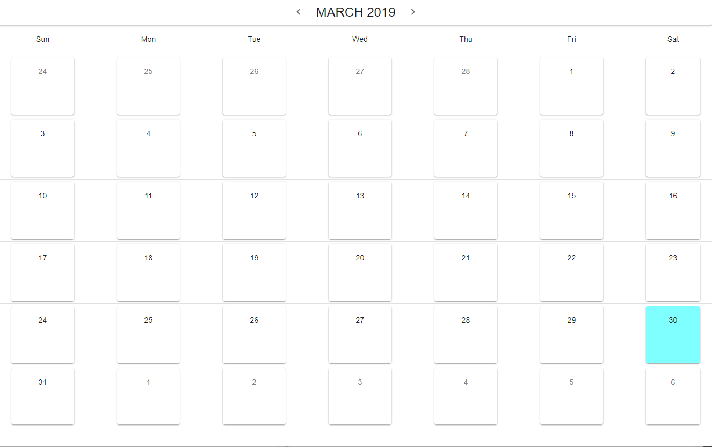

# react-material-ui-calendar

> React calendar using material-ui

[](https://www.npmjs.com/package/react-material-ui-calendar) [](https://standardjs.com)

## Install

```bash
npm install --save react-material-ui-calendar
```

## Usage

```jsx
import React, { Component } from "react";

import Calendar from "react-material-ui-calendar";

class Example extends Component {
  render() {
    return <Calendar />;
  }
}
```

##Props

###generalStyle
generalStyle is a prop you can pass to the component to style the calendar window.

```jsx
class Example extends Component {
  render() {
    return (
      <Calendar
        generalStyle={{
          maxWidth: "100%",
          margin: "0 auto",
          backgroundColor: "rgba(0,0,0,1)",
          height: "100%",
          overflow: "auto"
        }}
      />
    );
  }
}
```


###light
light mode turns the normal white text to black text. Default is set to false.

```jsx
class Example extends Component {
  render() {
    return (
      <Calendar
        generalStyle={{
          maxWidth: "100%",
          margin: "0 auto",
          backgroundColor: "rgba(256,256,256,1)",
          height: "100%",
          overflow: "auto"
        }}
        light={true}
      />
    );
  }
}
```



## License

MIT © [joswong13](https://github.com/joswong13)
